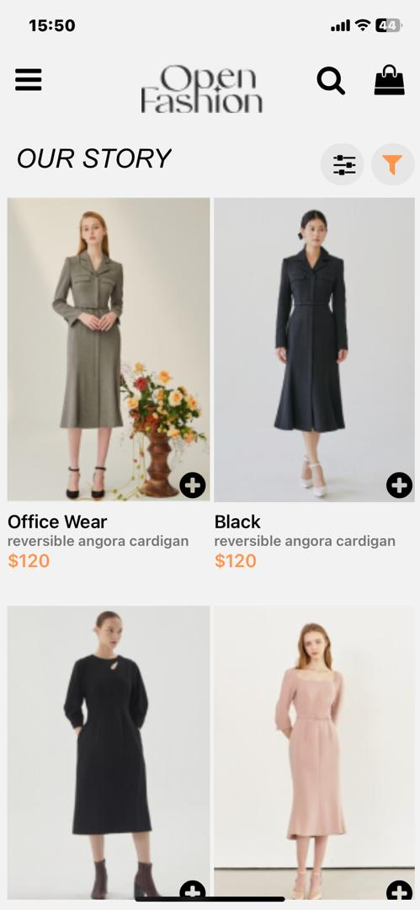
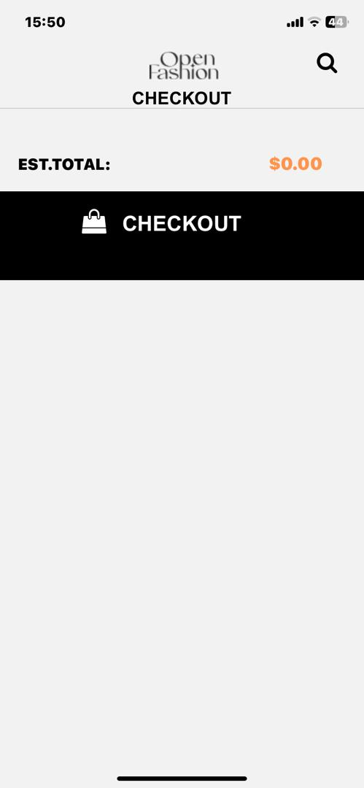
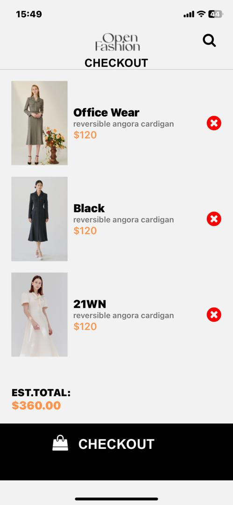

# BoutiqueApp

Welcome to BoutiqueApp! This is a mobile application built using React Native for managing a boutique store.

## Features

- User authentication: Users can create an account and log in to access the app's features.
- Product catalog: Browse and search for products available in the boutique store.
- Shopping cart: Add products to the cart and proceed to checkout.
- Order history: View past orders and track their status.
- Notifications: Receive updates on order status and promotions.

## Installation

1. Clone the repository: `git clone https://github.com/Nana-Yaw-Oteng/rn-assignment6-11038553`
2. Install dependencies: `npm install`
3. Start the development server: `npm start`
4. Run the app on a simulator or device: `npm run android` or `npm run ios`

## Technologies Used

- React Native
- Redux
- React Navigation

## Contributing

Contributions are welcome! If you find any bugs or have suggestions for new features, please open an issue or submit a pull request.

